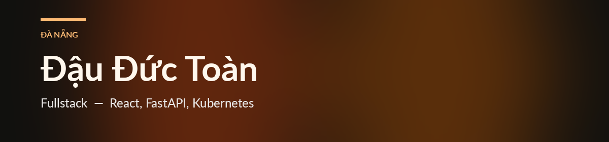

<table>
<tr>
<td width="58%" valign="top">

### Xin chào

Mình là Toàn, làm web ở Đà Nẵng. Hay bắt đầu từ màn hình người dùng, viết API cho nó, rồi đóng gói để chạy trên Kubernetes.

Muốn nói chuyện về một sản phẩm hoặc một hệ thống đang chạy, cứ mail.

 

</td>
<td width="42%" valign="top">

### Stack

</td>
</tr>
</table>
